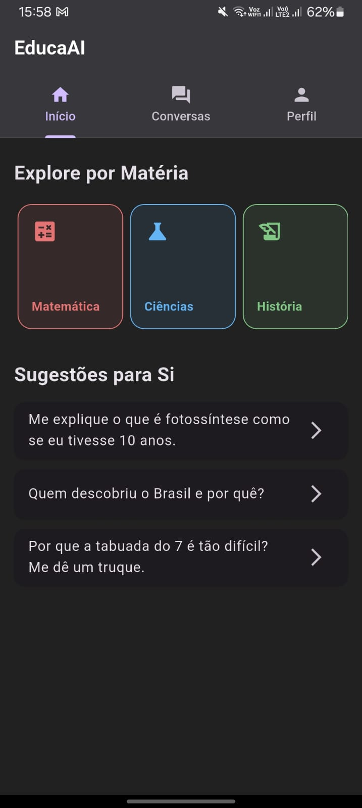
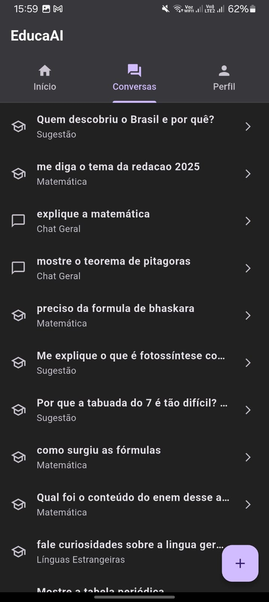
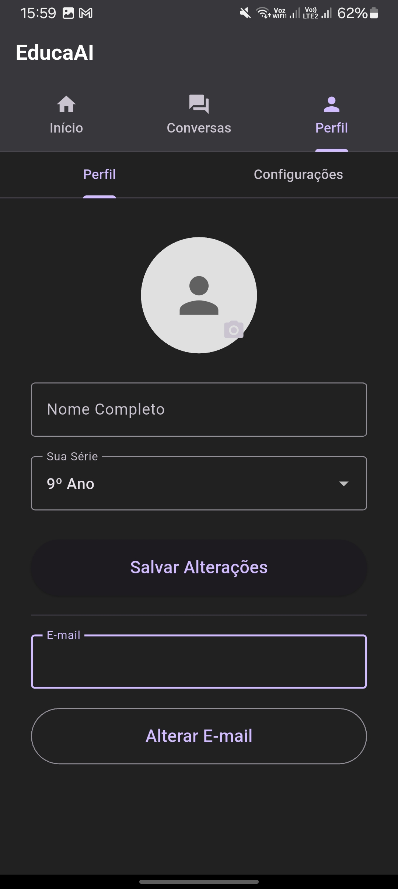
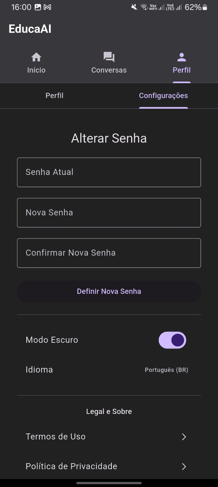

# 🎓 EducaAI: O Tutor de IA Personalizado

O EducaAI é um aplicativo móvel, construído em Flutter, que funciona como um tutor de Inteligência Artificial para alunos do Ensino Fundamental. A sua principal característica é adaptar as suas respostas com base na **Base Nacional Comum Curricular (BNCC)** e no perfil de aprendizagem único de cada aluno.

Este projeto foi desenvolvido como um projeto académico para a matéria de Desenvolvimento Mobile, na Faculdade Nobre de Feira de Santana.

---

### ✨ Funcionalidades Principais (Features)

* **IA Contextualizada:** As respostas do chat são guiadas pela **BNCC** e filtradas pela **Série/Ano Escolar** do aluno.
* **Quiz de Personalização:** Um quiz inicial que define a personalidade da IA ("Amigável", "Professor", "Divertido") para adaptar o tom de voz.
* **Navegação Multi-ecrã:** Interface moderna com navegação por *swipe* (deslizar) e Abas (Tabs) no topo (Início, Conversas, Perfil).
* **Gestão de Conta Completa:** Fluxo de autenticação completo, incluindo registo, login, redefinição de senha e exclusão de conta.
* **Perfil Personalizável:** Os utilizadores podem atualizar o seu nome, série, e-mail e foto de perfil (com *upload* para a nuvem).
* **Histórico de Conversas:** Todos os chats são guardados e podem ser revistos ou apagados pelo utilizador.
* **Tema Claro/Escuro:** O aplicativo suporta e guarda a preferência de tema do utilizador.
* **Termos de Uso:** Implementação de um fluxo de bloqueio para aceitação dos Termos de Uso e Política de Privacidade.

---

### 🚀 Tecnologias Utilizadas (Stack)

* **Framework:** Flutter (Dart)
* **Base de Dados (BaaS):** Firebase
    * **Cloud Firestore:** (Base de dados NoSQL para perfis de utilizador, histórico de chats e configs)
    * **Firebase Authentication:** (Login, registo, redefinição de senha, segurança de e-mail/senha)
    * **Firebase Storage:** (Armazenamento de ficheiros para fotos de perfil)
    * **Firebase App Check:** (Segurança do *backend*)
* **Inteligência Artificial:** API Google Gemini
* **Gestão de Estado:** Provider
* **Formatação:** `flutter_markdown` e `flutter_markdown_latex` (para renderizar Markdown e fórmulas matemáticas)

---

### Telas do EducaAI

<p align="center">
  
  
  
  
  
</p>

---

### ⚙️ Como Executar o Projeto

Este projeto utiliza o Firebase. Para o executar localmente, você precisará de criar o seu próprio projeto Firebase.

1.  **Clone o repositório:**
    ```bash
    git clone [https://github.com/HanielCS/EducaAI]
    cd educaai
    ```

2.  **Obtenha as dependências:**
    ```bash
    flutter pub get
    ```

3.  **Configure o Firebase:**
    * Vá ao [Console do Firebase](https://console.firebase.google.com/) e crie um novo projeto.
    * Ative os serviços: **Authentication**, **Firestore**, **Storage** e **App Check**.
    * Execute `flutterfire configure` para ligar o seu projeto e descarregar o `google-services.json`.

4.  **Configure a API Gemini (O Ficheiro Secreto):**
    * Na pasta `lib/config/`, renomeie o ficheiro `constants.dart.example` para `constants.dart`.
    * Abra o `constants.dart` e cole a sua chave da API do Google Gemini:
        ```dart
        const String GEMINI_API_KEY = "SUA_CHAVE_DE_API_VEM_AQUI";
        ```

5.  **Execute o aplicativo:**
    ```bash
    flutter run

    ```

